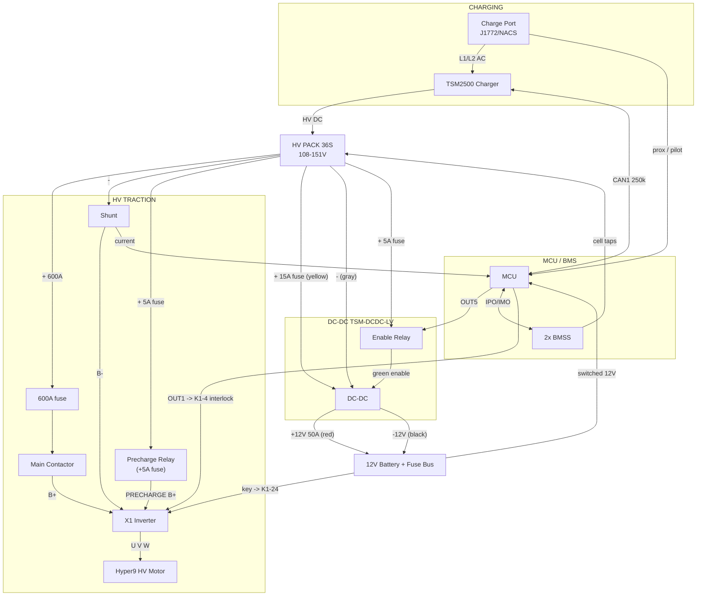

# Ranger EV — Step-by-Step Wiring Plan (per Thunderstruck manuals)

## Complete connection reference (everything wired together)

### HV bus (pack+ / pack−) — every branch fused
- pack+ → **600A fuse** → main contactor → **X1 B+**
- pack+ → **15A HV fuse** → **DC-DC yellow** (B+ input)
- pack+ → **5A HV fuse** → **precharge relay** → **X1 PRECHARGE B+** (V–W)
- pack+ → **5A HV fuse** → **enable relay** → **DC-DC green** (enable)
- **charger HV out (SB50 red/black)** → pack+ / pack−
- pack− → **shunt** → **X1 B−** ; pack− → **DC-DC gray** (B− input)

### X1 inverter
- B+ ← contactor · B− ← shunt · U/V/W → motor · PRECHARGE B+ ← precharge relay
- K1-24 (BLU) ← switched 12V via 10A fuse · K1-1 (BLK/BLU) → 12V ground
- K1-4 (GRN) ← **E-stop → MCU OUT1** (interlock)
- K1-11 throttle · K1-5/K1-6 F/R · encoder K1-35/21/33/9 · thermistor K1-32/12
- K1-25/K1-26 → contactor coil
- K1-13 (CAN-H) / K1-2 (CAN-L) → **Pi can1** ; short K1-3↔K1-14 = X1 term
- K3 serial → laptop (SmartView)

### MCU (BMS)
- Conn A: A1/A10 GND · A2 12V (always-on) · A3 KSI (keyswitch 12V) · A4 CAN1_L / A5 CAN1_H · A6–A9 IPO/IMO → BMSS
- Conn B: current sensor (+5V/IN1/IN2/GND, hall1/hall2)
- Conn C: PROXIMITY ← port PP · PILOT ← port CP
- Conn D: **OUT1** → E-stop → K1-4 · **OUT5** → enable-relay coil · OUT5_12V → 12V · CAN2 unused

### DC-DC (TSM-DCDC-LV)
- yellow ← 15A fuse ← pack+ · gray ← pack− · green ← enable relay
- red (+12V) → 50A fuse → 12V batt+ · black (−12V) → 12V batt−

### Enable relay (OUT5 → DC-DC): white(86)←OUT5, black(85)→gnd, red(30)←5A fuse←pack+, blue(87)→DC-DC green

### Charger (TSM2500)
- AC in: brown(L)/blue(N)/yellow-green(PE) ← charge port AC
- HV out: red(+)/black(−) → pack
- CAN: green-wht(CAN-H)→MCU A5 · blue-wht(CAN-L)→MCU A4 · +120Ω at charger

### Charge port (J1772/NACS)
- L1/L2 → charger AC · PE → ground · CP → MCU PILOT · PP → MCU PROXIMITY (NO CAN at port)

### CAN buses
- **CAN1 (250k)**: MCU A4/A5 + charger + Pi can0 → battery/charging. Term: MCU internal + charger 120Ω
- **X1 CAN (TM4)**: X1 K1-13/K1-2 + Pi can1 → motor/speed. Term: X1 (K1-3↔K1-14) + Pi jumper
- **CAN2 (500k canopen)**: unused

### 12V system
- 12V battery → fuse bus (constant + switched) · switched 12V → X1 K1-24 (10A), MCU KSI, relay coils
- DC-DC keeps battery charged when HV live · **HV− isolated from 12V/chassis ground**

## FULL CAN WIRE-UP (both buses → Pi 2-channel HAT)

Two independent buses. Pi taps BOTH (one per HAT channel). MCU internal terminators
CONFIRMED (manual p.11/25) — MCU must be a terminal/end node.

### Bus 1 — CAN1 (Thunderstruck, 250k) → battery + charging → Pi can0
Devices in a line: **MCU — charger — Pi** (charger in the middle)
```
MCU A5 (CAN1_H) ──── charger green/wht (CAN-H) ──── Pi can0_H
MCU A4 (CAN1_L) ──── charger blue/wht  (CAN-L) ──── Pi can0_L
   [internal 120Ω]        [MIDDLE: no term]        [HAT can0 jumper ON]
        END                                              END
```
- Baud **250k** (`can1br 250` ✅) · cap charger yellow+pink
- Terminators: **MCU internal + Pi HAT can0 jumper** = 60Ω (charger middle = NO resistor)
- Carries: SOC, pack V, current, all cell voltages, cell temps, faults (battery dashboard)

### Bus 2 — X1 CAN (TM4) → motor/speed → Pi can1
Devices: **X1 — Pi** (two nodes)
```
X1 K1-13 (CAN-H) ──── Pi can1_H
X1 K1-2  (CAN-L) ──── Pi can1_L
  [short K1-3↔K1-14]   [HAT can1 jumper ON]
      END                    END
```
- Baud = **X1's CAN baud** (check SmartView)
- Terminators: **X1 internal (K1-3↔K1-14) + Pi HAT can1 jumper** = 60Ω
- Carries: motor RPM/speed, motor + inverter temp, torque

### CAN2 (500k) — unused

### Pi setup (2-CH CAN HAT)
- config.txt: two mcp2515 overlays (check your HAT wiki for oscillator/interrupt)
- `ip link set can0 up type can bitrate 250000` (Thunderstruck)
- `ip link set can1 up type can bitrate <X1 baud>`
- Prove data: `candump can0` (MCU/battery frames), `candump can1` (X1/motor frames)

### Verify each bus: power off → measure CAN-H↔CAN-L → **60Ω** (40Ω = 3 terminators)

## Full system diagram



## DC-DC + enable relay detail (what you're wiring now)

```
              HV BUS (pack +)
 [HV PACK](+)──┬─────────────┬──────────────┬─────────────► 600A ─ contactor ─► X1 B+
      │        │             │              │
      │     [15A HV]      [5A HV]        [5A HV]
      │     DC-DC in     precharge      DC-DC enable
      │        │             │              │
      │   DC-DC YELLOW   precharge     ENABLE RELAY
      │   (Pack B+)       relay        red(30)───87(blue)──► DC-DC GREEN (enable)
      │                     │          coil: white(86)←MCU OUT5
      │              X1 PRECHARGE B+         black(85)←ground
      │                  (V-W)
 [HV PACK](-)──┬─[Shunt]──► X1 B-
               └──────────► DC-DC GRAY (Pack B-)

 DC-DC 12V out:  RED(+12V) ──[50A fuse]──► 12V Battery (+)
                 BLACK(-12V) ───────────► 12V Battery (-) / ground

 ⚠️ never swap yellow/gray (HV in) with red/black (12V out)
 ⚠️ HV- stays isolated from 12V/chassis ground
```

---


Corrected build/fix order. Follows the TSM-DCDC-LV, TSM2500, MCU, and X1 manuals.
**Work with HV disconnected. Fuse every positive branch. HV− never ties to 12V/chassis ground.**

Key correction vs earlier: **OUT5 drives the DC-DC ENABLE relay** (Thunderstruck's intent),
NOT the X1 interlock. The X1 interlock (traction safety) moves to a **separate MCU output**.

---

## Section 1 — HV traction loop (verify; mostly built)
- [ ] Pack **(+) most positive → 600A main fuse → main contactor → X1 `B+`**
- [ ] Pack **(−) most negative → shunt → X1 `B−`**
- [ ] X1 **U / V / W → motor U / V / W**
- [ ] **Precharge:** pack+ → **5A HV fuse → precharge relay → X1 PRECHARGE B+** (between V–W)
- [ ] **Contactor coil:** X1 **K1-25 (BLU/WHT) = coil+**, **K1-26 (ORG/WHT) = coil−**
- [ ] B− tied to Pack− (required for precharge to complete)

## Section 2 — HV distribution to DC-DC + charger
Both tap the HV bus (pack side). Each gets its OWN HV fuse.
- [ ] **DC-DC HV in:** Yellow (Pack B+) → **15A HV fuse → pack+** ; Gray (Pack B−) → **pack−**
- [ ] **Charger (TSM2500) HV out → pack** (per TSM2500 manual; its own HV fusing)
- [ ] ⚠️ Confirm whether DC-DC/charger HV is "always hot" or gated (parasitic-drain check)

## Section 3 — DC-DC 12V output
- [ ] **Red (+12V out) → 12V battery (+)** via **50A 12V fuse**
- [ ] **Black (−12V out) → 12V battery (−) / 12V ground**
- [ ] ⚠️ Do NOT swap input (yellow/gray=HV) with output (red/black=12V) — destroys the unit
- [ ] ⚠️ HV− stays isolated from 12V/chassis ground

## Section 4 — DC-DC ENABLE relay (driven by MCU OUT5)  ← the rewire
Relay (your irhapsody): coil 85/86, contacts 30(common)/87(NO)/87a(NC).
- [ ] **Coil:** white(86) → **MCU OUT5** ; black(85) → **ground**
- [ ] **Contacts (switch pack+ to the enable wire):**
      red(30) → **pack+ via 5A HV fuse** ; blue(87, NO) → **DC-DC green Enable wire**
- [ ] yellow(87a) unused/capped
- [ ] Result: BMS OK → OUT5 on → relay closes → pack+ reaches green → **DC-DC enabled**

## Section 5 — X1 interlock (traction safety) → OUT1 (NO relay needed)
OUT1 is open-collector (grounds when active) — perfect for the X1's active-low interlock.
Just two connections, in series with the E-stop:
- [ ] **X1 K1-4 (green) → E-stop terminal 1**
- [ ] **E-stop terminal 2 → MCU OUT1** (Conn D pin 1)
- [ ] No separate ground wire — OUT1 grounds internally when active
- [ ] Rewire note: move the E-stop's far end **from the relay's red(30) → to MCU OUT1**
      (frees the relay for the DC-DC enable)
- [ ] Config: `set out1 -(hwfault ccensus tcensus hvc lvc hipack lowpack hitemp lowtemp notlocked)`
- Behavior: BMS OK + E-stop closed → OUT1 grounds K1-4 → traction enabled; any fault or E-stop
  press → K1-4 floats → traction disabled (fail-safe).

## Section 6 — MCU / BMS (verify; mostly built)
- [ ] Power: A2 12V (always-on, fused) · A1/A10 GND · A3 KSI (keyswitch 12V)
- [ ] CAN1 (A4/A5) → charger (+ Pi) @ 250k, two 120Ω terminators
- [ ] IPO/IMO (A6–A9) → BMSS satellites ; current sensor → IN1/IN2 (hall1/hall2)
- [ ] Charge port PROXIMITY (C4) / PILOT (C5) ← J1772 prox/pilot

## Section 7 — Charger (TSM2500)
- [ ] **AC in: L1 / L2 (+ PE ground) ← charge port** AC pins
- [ ] **HV DC out → pack** (Section 2)
- [ ] **CAN → MCU CAN1** (J3: pin9 CAN-H green, pin8 CAN-L blue) @ 250k
- [ ] Enable/control per TSM2500 manual (MCU is charge controller)

## Section 8 — 12V system
- [ ] 12V battery → main fuse/breaker → 12V fuse bus (constant + switched)
- [ ] Keyswitch → MCU KSI and X1 K1-24 (each fused)

## Section 9 — MCU config (PuTTY)
- [ ] `bms`: hvc 4.2, lvc 3.0, hvcc 4.15, lvcc 3.1, hipackv 155, lowpackv 100, thmax 50, thmin 0
- [ ] `bms`: enable thermistor all → `lock`
- [ ] `sys`: **`set out5 -(lvc lowpack tcensus)`** ← DC-DC enable (per manual)
- [ ] `sys`: **`set out1 -(hvc lvc hipack lowpack hitemp lowtemp notlocked)`** ← X1 interlock BMS-OK

## Pre-HV gates (before connecting the pack)
- [ ] K1-24 on 12V (NOT pack voltage)
- [ ] Throttle rests at 0%
- [ ] 12V supply solid (battery healthy / bench supply ~13V)
- [ ] Wheels off ground, E-stop tested, pack polarity verified
