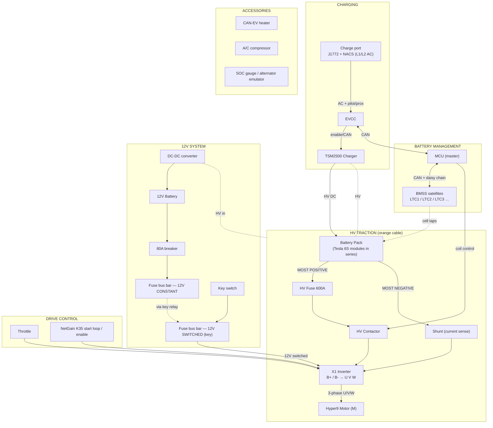

# 1986 Ford Ranger EV Conversion — Wiring Reference

Reconstructed from the hand-drawn master diagram. Use the checklists to verify every
connection physically. Items marked **⚠️** are my best reading of the drawing and need
your confirmation.

## STATUS (2026-06-29)
- ✅ X1 commissioned on bench: powered, firmware flashed, clone loaded, encoder reading, faults
  clear except expected USER UNDERVOLTAGE (no HV).
- ✅ X1 inputs verified in Monitor: F/R, throttle, interlock all working (inputs are **active-low**;
  green = floating-high resting state).
- ✅ Inverter confirmed = **AC-X1 120/144V 500A** (HV variant); 36S pack safely in range.
- ✅ MCU (Thunderstruck, S/N MCU1088, "V1.0") wired; serial console working (115200 8-N-1 via
  FTDI TTL-232R-5V-AJ on the 3.5mm jack by Connector A).
- ✅ BMS reads all **36 cells (C1–C36) ~3.61V, 20mV spread = healthy/balanced** → both BMSS18 +
  all cell taps wired correctly.
- ✅ MCU as **charge controller** (no separate EVCC); prox/pilot → charge port, L1/L2 → TSM2500.
- ▶️ NEXT: verify **MCU→inverter link** = OUT5 (BMS-OK) → X1 K1-4 interlock (needs OUT5_12V on
  12V + X1 interlock set active-high). Then HV-side wiring (precharge relay, B−↔Pack−), then HV-on
  spin-sensor calibration (wheels up).

## Component legend

| Tag | Component | Manual |
|---|---|---|
| **M** | NetGain Hyper9 HV motor | `Hyper9_X1_System_User_Manual.pdf` |
| **X1** | Hyper-Drive X1 inverter / motor controller | same |
| **MCU** | Thunderstruck Master Control Unit (BMS master) | `Thunderstruck_MCU_Manual.pdf` |
| **BMSS** | Thunderstruck BMSS satellite cell-monitor boards (LTC1/2/3…) | same |
| **OBC** | Thunderstruck TSM2500 charger (on-board charger) | `Thunderstruck_TSM2500_Charger_Manual_v1.08.pdf` |
| **EVCC** | Thunderstruck Electric Vehicle Charge Controller | (get from TS site) |
| **DC-DC** | DC-DC converter, 1000 W min (HV → 12 V) | — |
| **Pack** | Tesla modules, 6S groups in series | — |

---

## 0. System block diagram

---

## 1. HV traction loop  (the dangerous one — verify first, pack disconnected) ✅ confirmed

All inside the HV junction / controller box. Contactor on the **positive** leg; main fuse +
shunt on the **negative** leg.

**Positive leg**
- [ ] Pack **MOST POSITIVE** → **HV Contactor** input
- [ ] HV Contactor output → **X1 `B+`**

**Negative leg**
- [ ] Pack **MOST NEGATIVE** → **HV Fuse (600 A)** → **Shunt** → **X1 `B−`**
- [ ] (One fuse anywhere in this series loop protects the whole loop — negative-leg placement is fine.)

**Precharge** — handled by the X1 internally:
- [ ] X1 is an **ISO** model → **precharge terminal between V–W** is wired per the X1 manual
- [ ] No separate precharge resistor/relay required
- [ ] Confirm the ISO logic board is powered (12–24 V+) so precharge actually runs

**3-phase to motor**
- [ ] X1 `U` → Motor `U`
- [ ] X1 `V` → Motor `V`
- [ ] X1 `W` → Motor `W`

**Mechanical**
- [ ] Box plate: "screw to plate at bottom, insulate — **don't drill through the box**"
- [ ] Gland nut / M67 fitting where HV cable enters box

**Notes from drawing:** "could be steel?" (box material) · HV cable "don't take off box" ·
use 600 V-rated wire for HV runs · pack is 36S (~108–151 V), well inside the HV's 90–180 V.

---

## 2. X1 low-voltage control ✅ VERIFIED from the manual's ISOLATED LOGIC diagram (p.10, p.13)

Your X1 is **ISOLATED LOGIC** (it has the V–W precharge terminal), so use the **ISO** diagram.
Pin numbers below are authoritative (read from the rendered manual page). Wire colors are as
drawn in the NetGain diagram — verify against your actual K1 harness before cutting.

### What powers the X1 (ISO)
- **K1-24 = +12–24V KEY** ← switched 12V from the car/12V battery through the **key switch**
  (route via the **10A control fuse**). *This is the wire that powers the X1.*
- **K1-1 = 12–24V KEY RETURN** ← back to the 12V supply negative.
- On ISO, **K1-24 only ever sees 12–24V** — *never* HV. (On NON-ISO it would see pack voltage;
  you are NOT that variant.)
- **K1-10 is a +12V OUTPUT** — do **not** power the controller from it.

### Main contactor coil (✅ your drawing was right)
- **K1-25 = COIL RETURN (+)** → contactor coil **positive**
- **K1-26 = DRIVER OUTPUT 1 (−)** → contactor coil **negative** (X1 PWM-economizes the coil)
- Contactor is "externally economized" (included with the HyPer system).

### 🚨 CORRECTION FOUND (2026-06-28): build was wired NON-ISO, but X1 is ISO
The HV relay was set up as a **Key Switch Relay** (NON-ISO pattern), feeding **pack voltage to
K1-24**. On this **ISO** inverter K1-24 max is **28V** — pack voltage there destroys the controller.
Two fixes:
- [ ] **K1-24 (solid BLUE):** move OFF the relay → **switched 12V via the 10A fuse**.
- [ ] **HV relay → repurpose to PRECHARGE relay:** move its output from K1-24 → **5A fuse →
      PRECHARGE B+ terminal**. Coil (switched 12V + gnd) and HV input (pack+) stay as-is.
- [ ] ⛔ Do NOT connect the HV pack until both are done.

### Precharge (ISO) — what plugs into the PRECHARGE B+ terminal
- Feed: **Pack(+) most positive → 5A fuse → HV Precharge Relay (N.O.) → X1 PRECHARGE B+** (the
  terminal between V–W).
- **Do NOT add an external resistor** — the precharge resistor is internal to the X1.
- **HV Precharge Relay coil** is energized by the **key switch ON** position, *before* START /
  before the main contactor closes (recommended over hard-wiring; no parasitic pack drain).
- **B− must be tied to HV Pack−** or the precharge circuit won't complete (manual requirement).
- Don't confuse with **+B**: +B gets pack+ via the **main contactor** (+ 600A fuse); PRECHARGE B+
  gets pack+ via the **5A fuse + precharge relay**. Two feeds off the same pack-positive node.

### Throttle / brake (analog, 0–12V, 125 kΩ pull-down)
- **K1-35 = +5V OUT** (shared reference to all pots)
- **K1-11 = ANALOG IN 1** = First throttle pot wiper
- **K1-17 = ANALOG IN 2** = Second throttle pot wiper
- **K1-23 = ANALOG IN 3** = Brake pot wiper

### Direction / enable digital inputs (active-high +12/24V, common return to K1-1)
- **K1-4 = DIGITAL IN 1 = INTERLOCK / Traction Enable** ← wire **BMS-OK here** (see safety note)
- **K1-5 = DIGITAL IN 2 = FORWARD**
- **K1-6 = DIGITAL IN 3 = REVERSE**
- **K1-18 = DIGITAL IN 7 = PROFILE 2**
- **K1-19 = DIGITAL IN 8 = PROFILE 3**
- **K1-1 = I/O GROUND** (active-low selection common)

### Encoder — motor 4-pin Amp Superseal (plug 282088-1)
| Encoder pin | Signal | X1 pin |
|---|---|---|
| 1 | +5V | **K1-35** |
| 2 | Encoder Sin 1 | **K1-21** |
| 3 | Encoder Cos 1 | **K1-33** |
| 4 | Encoder I/O Ground | **K1-9** |

### Motor thermistor — 2-pin Amp Superseal (plug 282080-1, in the HyPer 9HV)
| Thermistor pin | Signal | X1 pin |
|---|---|---|
| 1 | Analog Ground | **K1-12** |
| 2 | Motor Thermistor | **K1-32** |

### Comms / display
- **Serial (config / "Smart View" / TAU):** K3-3 = RS-232 TX, K3-2 = RS-232 RX, K3-5 = ground
  (SUB-D9 null-modem on the K3 port).
- **Display (SME Compact):** K1-10 = +12V OUT, **K1-15 = LIN IN/OUT**, K1-12 = ground.
  → the display is on **LIN**, confirming the X1↔display link is LIN, not CAN.
- **X1 CAN port (separate from Thunderstruck CAN):** K1-13 = CAN-H (ORG), K1-2 = CAN-L (GRY);
  short **K1-3 ↔ K1-14** to enable the X1's internal 120 Ω termination. TM4 protocol — likely
  unused in this build.

### Deceleration-lights relay (optional, regen brake lights)
- Small external relay: coil between **K1-10 (+12V OUT)** and **K1-30 (Digital Out 1)**.
- X1 activates Digital Out 1 on regen → coil energizes → relay contacts switch 12V to brake lights.
- 18–20 AWG; optional; not needed for bench testing.

### K1 harness — EXACT wire colors (manual p.8, "Standard K1 Wire Harness — Pinout")

35-pin Ampseal (K1 plug). These are the real harness colors.

| Pin | Function | AWG | Color |
|---|---|---|---|
| 1 | I/O Ground | 18 | BLK/BLU |
| 2 | CAN Low | 20 | GRY |
| 4 | Interlock | 18 | GRN |
| 5 | Forward Switch | 18 | WHT |
| 6 | Reverse Switch | 18 | YLW |
| 7 | Clutch Switch | 18 | WHT/BLU |
| 9 | Encoder Ground | 20 | BLK under RED foil |
| 10 | 12V + (OUTPUT) | 18 | RED/BLU |
| 11 | Throttle Wiper 1 | 18 | YLW/WHT |
| 12 | Analog Ground | 18 | BLK |
| 12 | Thermistor Ground | 20 | BLK under GRN foil |
| 13 | CAN High | 20 | ORG |
| 17 | Throttle Wiper 2 | 18 | GRN/YLW |
| 18 | Profile 2 switch | 18 | WHT/RED |
| 19 | Profile 3 switch | 18 | PURP |
| 21 | Encoder SIN1 | 20 | BLK under BLU foil |
| 23 | Brake Pot Wiper | 18 | YLW/RED |
| 24 | **Key Switch In** | 18 | **BLU** |
| 25 | **Coil Return +** | 18 | **BLU/WHT** |
| 26 | **Driver Out −** | 18 | **ORG/WHT** |
| 30 | Deceleration Lights | 18 | ORG/RED |
| 32 | Motor Thermistor | 20 | WHT under GRN foil |
| 33 | Encoder COS1 | 20 | GRN under BLU foil |
| 35 | 5 Volt + | 18 | RED |
| 35 | Encoder 5 Volt + | 20 | RED under RED foil |

Motor multipair cable (thin 20 AWG, shielded foil pairs): GRN foil = thermistor (12+32),
BLU foil = encoder SIN/COS (21+33), RED foil = encoder pwr/gnd (9+35).

## 8. X1 startup wiring (staged) — colors per the K1 harness

> ⚠️ Motor calibration required: the X1 clone file must have its **spin sensor commissioned to
> your motor in Smart View before the motor is ever spun** (manual p.9). Do Stage A/B first.

### Stage A — power up the logic board (NO HV connected)
Minimum to make the controller come alive (Status LED → green):
- [ ] **Pin 24 (BLU) Key Switch In** ← switched 12V via the **10A fuse** from your key switch
- [ ] **Pin 1 (BLK/BLU) I/O Ground** ← 12V battery negative (this is the key return)
- [ ] Connect **K3 serial** → laptop running Smart View
- [ ] Confirm: Status LED green, Smart View connects, no active faults

### Stage B — make it commandable + readable (still NO HV)
- [ ] Throttle pot: **Pin 35 (RED) +5V** → pot high; wiper → **Pin 11 (YLW/WHT)**; pot low → **Pin 12 (BLK)**
- [ ] **Pin 4 (GRN) Interlock** ← +12V to enable drive — route this through your **BMS-OK** contact
      (jumper to 12V only for bench testing)
- [ ] **Pin 5 (WHT) Forward** ← +12V via forward switch  (Reverse = **Pin 6 (YLW)**)
- [ ] Motor encoder multipair → **9 / 21 / 33 / 35** (+ thermistor **12 / 32**)
- [ ] Verify in Smart View: throttle 0–100 %, interlock/forward toggle, encoder counts when shaft turned by hand

### Stage B½ — firmware + clone commissioning (SmartView, NetGain Clone File Mgmt guide)
NetGain requires **matching firmware + clone installed on every inverter via SmartView.** If
SmartView only shows the Firmware Update tab / greys out the rest, the firmware step is needed.
Order:
- [ ] Use the **matched** SmartView + firmware + clone for **AC-X1 144V/500A** (not 100V/750A)
- [ ] ⚠️ **Keep files with their ORIGINAL downloaded names** — SmartView validates by filename and
      silently rejects a renamed firmware/clone (this caused the "browse does nothing" issue)
- [ ] If a downloaded file won't load: extract from zip, **right-click → Properties → Unblock**,
      put it in a simple local path (not OneDrive online-only), and run **SmartView as admin**
- [ ] **Firmware:** Manage → Firmware Update → BROWSE → select firmware → run → **wait, don't
      interrupt power** (interrupting a flash can brick it). No HV connected.
- [ ] **Clone:** ⚠️ **disconnect motor phase cables (U/V/W) and/or throttle FIRST** — a generic/
      uncalibrated clone can cause unwanted torque / dangerous behavior. Then Manage → Clone →
      PC→Controller load icon → select `.clon` → OK. (Back up existing clone first if reachable.)
- [ ] **Commission the spin sensor** (motor/encoder calibration) before any spin — needs HV +
      wheels off ground. Uncalibrated clone = not safe to drive.
- [ ] SmartView home when truly connected shows **Monitor / Configure / Manage** — if you only
      ever get Firmware Update, you're either not connected (Connection→Normal→COM) or firmware
      genuinely needs flashing.

### Stage B¾ — bench wire-test matrix (12V, NO HV) — verify each wire in Monitor
Wiggle/actuate each, watch SmartView Monitor:
- [ ] **Key power** K1-24(BLU)/K1-1(BLK-BLU) → supply ≈ 11.5V, controller alive
- [ ] **Interlock** K1-4(GRN) Dig In 1 → toggles when interlock/BMS-OK switch flipped
- [ ] **Forward** K1-5(WHT) Dig In 2 → toggles; **Reverse** K1-6(YLW) Dig In 3 → toggles (independently!)
- [ ] **Profile 2** K1-18(WHT/RED) Dig In 7; **Profile 3** K1-19(PURP) Dig In 8 → toggle
- [ ] **Throttle** K1-11(YLW/WHT) Analog In 1 → ⚠️ rests at 0%, sweeps smooth to 100% (safety-critical)
- [ ] **Brake** K1-23(YLW/RED) Analog In 3; **2nd throttle** K1-17(GRN/YLW) Analog In 2 → change when moved
- [ ] **Encoder** K1-35/21/33/9 → both Sin & Cos move when shaft turned by hand; position counts
- [ ] **Motor thermistor** K1-32/12 → reads ~ambient, rises when warmed by hand
- [ ] **Contactor coil** K1-25(BLU/WHT)/K1-26(ORG/WHT) → command state + audible click
- [ ] Needs HV (later): B+/B− pack voltage reads & clears undervoltage; precharge; U/V/W spin (post-calibration)

### Stage C — HV + contactor (wheels off the ground)
- [ ] **Pin 25 (BLU/WHT) Coil Return +** → contactor coil +
- [ ] **Pin 26 (ORG/WHT) Driver Out −** → contactor coil −
- [ ] HV: **+B** → main contactor → pack+ ; **−B** → pack− ; **U1/V1/W1** → motor
- [ ] **Precharge B+** ← pack+ via 5A fuse + HV precharge relay (key-ON energizes relay)
- [ ] Commission spin sensor in Smart View, THEN first low-throttle spin

- [ ] **Throttle** (3-wire: +5V / signal / gnd) → X1 throttle input
- [ ] **NetGain K35 "start loop"** / enable-drive → X1 enable
- [ ] **12 V+ switched** feeds X1 ISO logic board (12–24 V+)
- [ ] **K1-24** ← 12V+ through key START **and** (see safety note) the BMS-OK contact
- [ ] **K1-25** → contactor coil negative
- [ ] **Serial port → "Smart View"** (X1 config/display tool)
- [ ] SME Compact Display → X1 (see `SME_Compact_Display_User_Manual.pdf`)

### Power-up sequence (verified)

1. Key **ON** → energizes the **HV precharge relay** → caps charge through the X1's V–W
   precharge terminal.
2. Key **START** → 12V+ reaches **K1-24** → **main contactor closes**.
3. Precharge relay drops out once the main contactor is closed.

### 🚨 BMS safety wiring — verify this

The standard X1 I/O table has **no dedicated BMS fault input.** For the MCU to open the pack
on an over/under-voltage or over-temp fault, you must:

- [ ] Wire the **MCU "BMS-OK" relay contact in SERIES** with the 12V+ feed to **K1-24**
      (and/or the precharge relay), so a BMS fault drops the contactor.
- [ ] Optionally also put the **crash/inertia switch** in that same series loop.
- [ ] Confirm the loop is **normally-closed when healthy** (opens on fault or loss of power).

**HV control fuses (✅ confirmed):** 10A → contactor coil circuit · 30A → DC-DC converter ·
10A → charger / EVCC.

---

## 3. Battery management (MCU + 2× BMSS, 6 Tesla modules) ✅ confirmed

Your config: **1 MCU (master) + 2 BMSS satellites monitoring 6 Tesla modules.**
Each BMSS covers **3 modules** (a Tesla module = 6S, so 3 modules = 18 series groups →
one **BMSS18** board per satellite).

- [ ] **MCU** = master; connects to the X1/contactor logic and the charger side
- [ ] **BMSS #1** → modules 1, 2, 3 (cell taps in series order, no gaps)
- [ ] **BMSS #2** → modules 4, 5, 6
- [ ] Each module's intermodule sense/balance taps land on its BMSS in correct cell order
- [ ] Daisy chain MCU → BMSS#1 → BMSS#2 using the isolated data pair **1PO/1MO** and
      **CAN HIGH / CAN LOW**, plus **LP1 / LP2**, **12V+**, **GND**
- [ ] Chain orientation: "send out → send", **tab + slot** keys the connectors — don't mirror them
- [ ] MCU → **HV contactor coil** control (opens pack on cell over/under-V or over-temp)
- [ ] MCU ↔ **EVCC** via CAN (pauses/stops charge on fault)
- [ ] All cell-tap wires routed together, 600 V rated, fused per the MCU manual

### Pack voltage sanity check — ✅ in range (Hyper9 **HV** confirmed)

You have the **Hyper9 HV** + **AC-X1 inverter — sticker confirms "AC-X1 120/144V 500A"**
(high-voltage variant, ~144 V nominal class, ~90–180 V range, **500 A** max).
⚠️ When downloading clone/firmware/SmartView, select the **144V / 500A** inverter — NOT the
standard "100V 750A" option.

- 6 Tesla modules × 6S = **36S**
- Empty (3.0 V/cell): ~**108 V**  ·  Nominal (3.7 V): ~**133 V**  ·  Full (4.2 V): ~**151 V**
- All three sit inside the HV's **90–180 V** window → pack size is a good match, no charge
  ceiling hack needed.
- Set the TSM2500 target to your preferred cell ceiling (4.1–4.2 V/cell ≈ 148–151 V).
- Keep the empty end above 90 V — i.e. don't run cells below ~3.0 V under load (the BMS
  low-cell cutoff handles this).

---

## 3b. Thunderstruck MCU connector pinout (manual Fig. 3, Rev 1.5)

Connectors (Harting): A=10p `14311013101000` · B=4p `14310413101000` · C=5p `14310513101000` ·
D=8p `14310813101000`. (Removal tool supplied to back wires out.)

**Connector A (10p)** — power / CAN1 / BMSS satellites
| Pin | Signal | Goes to |
|---|---|---|
| A1, A10 | GND | 12V ground |
| A2 | 12V | always-on 12V (fused) |
| A3 | KSI (Key Switch Input) | +12V when key ON |
| A4 / A5 | CAN1_L / CAN1_H | vehicle CAN (EVCC, TSM2500, Pi) |
| A6–A9 | IPO_A / IMO_A / IPO_B / IMO_B | BMSS satellite boards (isolated daisy-chain) |

**Connector B (4p)** — current sensor (LEM DHAB S137): B1 +5V · B2 IN1 · B3 IN2 · B4 GND
**Connector C (5p)** — C1–C3 IN3/IN4/IN5 · C4 PROXIMITY · C5 PILOT (J1772)
**Connector D (8p)** — D1–D4 OUT1–OUT4 (open-collector, 200mA, switch to GND) · D5 OUT5_12V ·
D6 OUT5 (1.5A +12V) · D7/D8 CAN2_L / CAN2_H

Notes: IN1–4 = 0–5V (14V tolerant); IN5 = pullup, measures resistance to ground. OUT1/2/3 can PWM.

### BMS-OK → X1 interlock (as built: OUT5)
This build uses **MCU OUT5 → X1 K1-4 (interlock)**. OUT5 switches **+12V** (so **OUT5_12V must be
fed 12V**), and the **X1 interlock (Dig In 1) must be set ACTIVE-HIGH** in SmartView.
- BMS healthy → OUT5 ON → +12V to K1-4 → interlock active → drive enabled
- BMS fault → OUT5 OFF (high-Z) → K1-4 pulled low → drive disabled (fail-safe)
- Verify link: PuTTY `enable out5` / `disable out5` while watching X1 Dig In 1 in SmartView Monitor.
- Then assign OUT5 the safe/contactor output function for automatic BMS-driven control.
- (Alt not used: OUT1–4 are open-collector → ground when active, matching the X1's default
  active-low interlock, no OUT5_12V needed — but OUT5 is what's physically wired here.)

### MCU ↔ inverter: NOT over CAN
MCU (Thunderstruck protocol) and X1 (TM4/DANA protocol) do **not** talk over CAN — keep them on
separate buses. Their only link is the **BMS-OK → interlock discrete signal** above. MCU CAN1 is for
the **TSM2500 charger** (+ Pi monitor); the X1's CAN port (K1-13/2) is separate/unused.

### MCU serial console (PuTTY)
FTDI **TTL-232R-5V-AJ** (5V USB→3.5mm TRS) into the jack by Connector A; FTDI VCP drivers.
**115200 baud, 8 data, 1 stop, no parity, no flow.** Contexts: `system` / `bms` / `evcc` / `inst`;
`help`, `show out`, `measure <in>`, `enable/disable outN`, `set …`.

## 4. Charging path  ✅ MCU is the charge controller (no separate EVCC)

The MCU (Dilithium) integrates EVCC functions — it handles J1772 directly. No standalone EVCC.

**Charge port (J1772 / NACS) — split into two jobs:**
- [ ] **PROXIMITY (PP)** → **MCU PROXIMITY** (Conn C pin 4, orange)
- [ ] **PILOT (CP)** → **MCU PILOT** (Conn C pin 5, purple)
- [ ] **L1 / L2 (AC power)** → **TSM2500 charger AC input** (NOT the MCU)
- [ ] Port **PE/ground** → chassis ground

**Charger control + power:**
- [ ] **MCU ↔ TSM2500 over CAN** (MCU commands charge current/start/stop on its CAN bus — green=CAN-H/J3 pin9, blue=CAN-L/J3 pin8; 250 kbps; two 120 Ω terminators)
- [ ] **TSM2500 HV DC out → Pack** (MCU/BMS gates charging, stops on cell fault)

Flow: plug in → MCU reads prox+pilot → MCU tells TSM2500 (CAN) how much → TSM2500 AC→HV DC → pack;
MCU/BMS watches cells, ends charge when full or on fault.

---

## 5. 12 V system

- [ ] **DC-DC converter** HV in (from pack side) → 12 V out → **12V battery +**
- [ ] 12V battery + → **80A breaker** → **12V CONSTANT fuse bus bar** ("always")
- [ ] **80A switch/breaker** main 12V disconnect ⚠️ (two 80A devices shown — confirm which is breaker vs. switch)
- [ ] **Key switch** → relay → **12V SWITCHED fuse bus bar** ("can on")
- [ ] Chassis ground bonded to 12V battery negative
- [ ] **15 A rated jumpers** between bus-bar sections
- [ ] **SOC gauge / "electronic alternator"** on 12V (emulates alternator output for stock gauge) ⚠️
- [ ] "Small relay turns on brake lights on regen" ⚠️
- [ ] Note: "Don't use lithium / Vita-Lead for the 12V" (use AGM/lead-acid 12V)

**Fuse / relay principle noted:** "switch carries thin wire (signal); relay passes the higher amps."

---

## 6. Accessories

- [ ] **CAN-EV heater** → "speed box" controller, on switched 12V ⚠️
- [ ] **A/C compressor** → bus bar "KS1 + ground" ⚠️
- [ ] **Crash inertia switch** ("trigger on crash") → cuts BMS/contactor ⚠️ (mentioned bottom-right)

---

## 7. CAN bus + Raspberry Pi monitor

**Two separate networks — don't conflate them:**

- **CAN bus (Thunderstruck):** MCU ↔ EVCC ↔ TSM2500 charger; MCU publishes BMSS cell/pack data.
  This is what the Pi monitors.
- **LIN bus (NetGain):** the X1 inverter uses LIN (pin **K1-15**), *not* CAN. Motor/throttle
  data is **not** on the CAN bus unless a gateway is added.

### Bus rules (verified)
- **Bitrate: 250 kbps, fixed** on all nodes (EVCC rate isn't configurable; TSM2500 + BMS require it).
- **Termination: exactly TWO 120 Ω, at the two physical ends only.**
  Verify by measuring **CAN_H ↔ CAN_L = 60 Ω, power off** (120 Ω = only one terminator;
  near 0 Ω = short / too many).

### Node + termination map
- [ ] Linear daisy-chain (no star/stubs): CAN_H and CAN_L run node-to-node
- [ ] Nodes on the bus: **MCU**, **EVCC** (⚠️ see note), **TSM2500**, **Pi (Waveshare HAT)**
- [ ] **TSM2500** has NO built-in terminator — CAN on connector **J3: pin 8 = CANL (blue),
      pin 9 = CANH (green)**
- [ ] End device #1 termination ON: __________ (MCU or EVCC)
- [ ] End device #2 termination ON: __________ (e.g. Pi Waveshare jumper, if Pi is an end)
- [ ] Middle devices termination OFF
- [ ] Twisted pair for CAN_H/CAN_L; shared ground reference between nodes

### ⚠️ MCU vs EVCC — confirm your build
The MCU **integrates BMS + EVCC + display** and has **two CAN interfaces**. So either:
- (a) you run the **MCU only** (it does charge control) and there's no separate EVCC, **or**
- (b) you have **both** an MCU and a standalone EVCC.
Confirm which — it changes the node list above and which MCU CAN port the Pi taps for
pack/SOC data.

### Raspberry Pi (Waveshare CAN HAT)
- [ ] Confirm crystal on the HAT: **8 MHz vs 12 MHz** (printed on the can) — wrong value = no bus
- [ ] `/boot/firmware/config.txt`:
      `dtparam=spi=on`
      `dtoverlay=mcp2515-can0,oscillator=12000000,interrupt=25,spimaxfrequency=2000000`
      (use `oscillator=8000000,spimaxfrequency=1000000` if it's an 8 MHz board)
- [ ] `can0` appears: `ip -details link show can0`
- [ ] Bring up: `sudo ip link set can0 up type can bitrate 250000`
- [ ] Sniff: `candump can0` (from `can-utils`) — expect frames once a Thunderstruck node is powered
- [ ] Pi termination jumper ON only if the Pi is at a physical end of the bus
- [ ] Access: Pi on **Tailscale**, SSH as `wstewarttennes@ranger`
- [ ] ⚠️ Dashboard software (speed + battery) — recover from SD card or rebuild (see below)

### Software recovery — first inventory what's still on the Pi
- [ ] `systemctl list-units --type=service | grep -iE 'can|bms|ranger|dash'`
- [ ] `crontab -l` and `ls /etc/systemd/system/`
- [ ] `ls ~ /opt /srv` for project dirs; check for `python-can`, `cantools`, Flask/Grafana
- [ ] Check `/boot/config.txt` (or `/boot/firmware/config.txt`) for the CAN HAT `dtoverlay`

## Build notes captured from the margins

- Boxes: **1/8" polycarbonate**; firewall pass-throughs
- Bus-bar / lug hardware: **1/4" or 5/16"**
- Tools called out: Klein insulated ratchet + screwdriver set
- "Tesla motor 10/1 diff", "93 axle to Tesla" — driveline note (not electrical)
- Cabling: good-quality shielded cable; proper crimps + heat (not a torch) on lugs

---

## Open questions

1. ✅ **HV order** — contactor on +leg, 600A fuse + shunt on −leg.
2. ✅ **Precharge** — X1 ISO precharge between V–W (verified in manual).
3. ✅ **Contactor coil** — X1 drives it: K1-24 enable (key START), K1-25 return.
4. ✅ **HV control fuses** — 10A contactor coil · 30A DC-DC · 10A charger/EVCC.
5. ✅ **X1 max voltage** — Hyper9 **HV** (90–180 V), 36S pack fits cleanly.
6. 🚨 **BMS-OK in the coil loop** — verify the MCU fault contact is wired in series with the
   12V feed to K1-24 (X1 has no dedicated BMS fault input). *Most important open item.*
7. **Charger control** — Is the TSM2500 driven by CAN from the EVCC, or analog enable? Which EVCC OUT pin?
8. **CAN bus** — see §7 below.
9. **Heater & A/C** — Confirm the heater "speed box" and compressor "KS1" connections.
